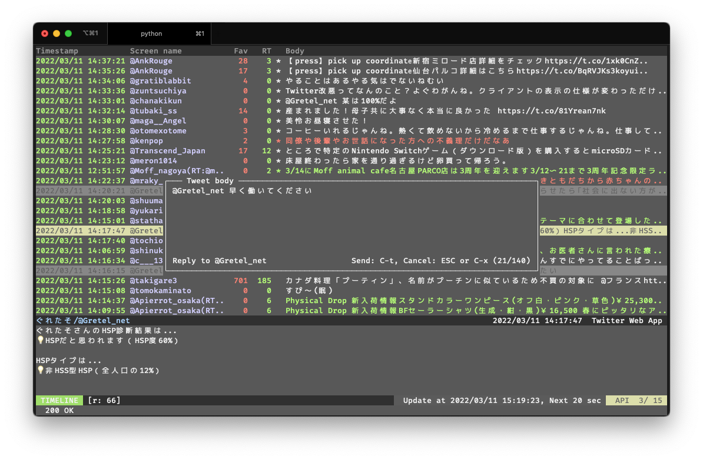
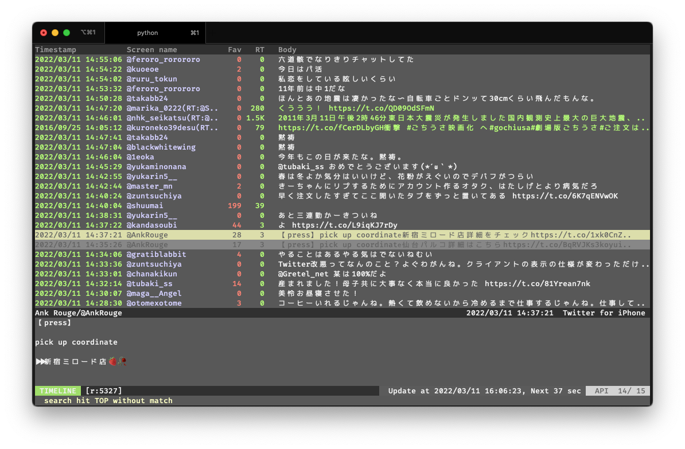
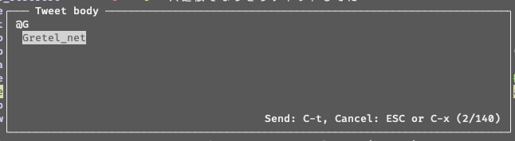
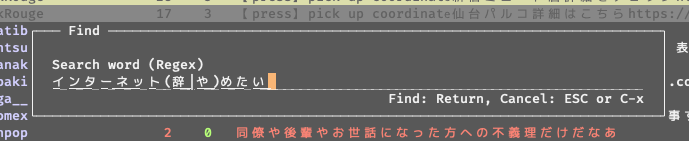
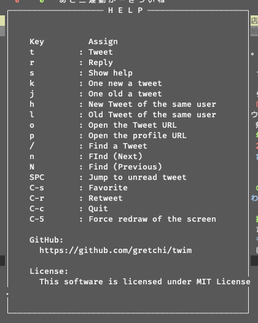

# twim

ターミナルで動くTwitterクライアントだよ
Windows の Twitter クライアントである Tween と vim にインスパイアされて作ったよ



## usage

setup.py は機能してないので､ pyenv で環境作るかシステムの Python3 で直に `pip install -r requirements.txt` すれば動かせる状態になるよ

```
# 起動コマンド
./twim.py
```

### 初回起動時


初回起動時にクライアントトークンを取得するために勝手にブラウザが開くよ｡

SSH経由とか､未対応OSでブラウザを開けない場合､ターミナルにURLが表示されてそれを手でブラウザに貼っつけて､取得したトークンをターミナルに貼っつけるとクライアントトークンが取得出来るって機能を実装したような気がするけど､引数渡す必要があったかも｡

アクセストークンとかは `${HOME}/.twim` に保存されるよ
## 画面



上から順に濃いグレーの仕切りで以下の3つのペインに分かれてるよ

- タイムライン
- ツイート詳細
- フッター


### タイムライン

ツイートの一覧を表示してる画面だよ｡後述の操作はこのペインに対して行われるよ
本文の色でそのツイートのステータスがわかるよ
色別の意味と表示の優先順位は以下の通り

1. 黄色背景: カーソル位置
1. グレー背景: カーソル位置のツイート主のツイート
1. 赤文字: ファボした
1. 緑文字: リツイート
1. 青文字: フォロワー外のツイート
1. 白文字: フォロワーのツイート

### ツイート詳細

カーソルのツイートの詳細が見れるよ
名前の部分はタイムラインでの色分けに準ずるよ
サイズ変更はできないので､文字数が多い時とか画像リンクが見たいときは `o` でブラウザが開くよ(後述)

### フッター

緑背景の `TIMELINE` はタイムラインモードを指してるよ｡今のところタイムラインモードしか無いよ
右はタイムラインの更新日時と次のTL取得までの秒数､ API の残弾が表示されてるよ
一番下はクライアントからのメッセージだよ｡API の制限引っかかってたりすると赤文字が表示されるよ

## 操作

基本的には Tween に準じた操作体系になってるよ
ちょっぴり vim テイストも入ってるよ

### カーソル移動

カーソル移動は `j` で一件古いツイート, `k` で一件新しいツイート, スペースで最新の未読ツイートにジャンプできるよ

### つぶやく

`t` でツイート `r` でカーソルのツイートに対してリプライ

`@` でリプライ先の候補がサジェストされるよ｡ `up arrow` キー, `down arrow` キーで選択できるよ




### ふぁぼ & RT

`Ctrl + s` or `Alt + s` ふぁぼ
`Ctrl + r` リツイート

### 検索

`/` で検索(正規表現)
`n` で次の検索結果(より古い), `N` で前の検索結果(より新しい)



### その他

`p` でカーソルのツイートのツイート主のプロフィールをブラウザで開く (環境依存)
`o` でカーソルのツイートをブラウザで開く (画像付きツイートとかこれで見て) (環境依存)

`Ctrl + S` 表示がおかしいときに強制的に再描画する

### ヘルプ

`s` キーを押すとヘルプが出るからわからなくなったら確認してみてね




## 動作環境

iTerm2 をターゲットに開発してるけどいくつか環境ごとの個別最適を施してるから他のOS､端末エミュレータでもある程度は動作すると思うよ

- Windows
    - Cygwin(Mintty) たぶん動いたはず
        - 初回の認証でブラウザ開かなかったかも
    - WSL2
        - 動作確認したことないけど標準だと初回のブラウザが開かないと思う
        - 表示とかキー操作とかは端末エミュレータに依存するよ
    - RLogin
        - SSH 経由で結構ちゃんと動いた気がする
- macOS
    - iTerm2 完全に動作
    - Terminal.app 一部修飾キーが動作しなかったような気がする
        - ESC キーが動作しなかったかも｡ Ctrl + x で代用できるようにしてあるよ
- Linux
    - GNOME-terminal だいたい動作した気がする
        - 初回の認証でブラウザ開けないディストリビューションがあるかも(Ubuntuは動いた)
        - ESC キーが動作しなかったかも｡ Ctrl + x で代用できるようにしてあるよ
        - 日本語入力が怪しい
- iOS
    - iSH あんまちゃんと動かなかったような気がする
- Android
    - Termux まあまあちゃんと動いた

## 既知の不具合とか直したいところとか

- ウィンドウサイズを変更すると curses がおかしくなる
- ツイートウィンドウを開いてる間ツイートの更新がされない
- ESC キーを認識しない端末エミュレータが多々ある (Ctrl + xで代用可)
- 文字入力バックスペース押すと消した文字が残ったりすることがある
- 文字入力で途中挿入ができないから出来るようにしたい


## Twitter Apps 及び API Key について

Twitter Apps (Twim Client) 及び､このアプリケーションに紐付く API Key (アクセストークン除く) は当リポジトリの所有者である gretchi 及び @Gretel_net に帰属するものであり､一切の二次利用を認めない｡

当アプリケーションの通常利用及び､ 当リポジトリの開発に利用する場合は一次利用の範囲内として API Key の使用を許諾する

### API Key 変更の手引き

Consumer Key(以下CK), Consumer Secret(以下CS) は暗号化された状態で `./api_key` に格納されています｡
`./api_key` 以下ディレクトリについては､ GNU Lesser General Public License が適用されていますので､ CK, CS の変更含む改変時には `./api_key` 以下のソースコードを公開する義務があります｡

暗号化及び復号に使用するパスワードは `ConsumerKeys()` の呼び出し時の引数と `./api_key/__init__.py` 内部の値によって生成されます｡ twim 本体は MIT License が適用されているため改変時においてもソースコードの公開の義務は発生しません｡ `ConsumerKeys` の呼び出し時､ `secret` に任意の文字列を指定することで CK, CS を秘匿することが可能です｡

ConsumerKeys の全ての引数をセットした状態で､ `api_key_encrypt.py` の引数に CK, CS を渡すことで暗号化された状態の CK, CS ならびに nonce が得られます｡得られた内容は `./api_key/__init__.py` に貼り付けてください｡

```sh
$ ./api_key_encrypt.py
Usage: ./api_key_encrypt.py <CONSUMER_KEY> <CONSUMER_SECRET>
```
